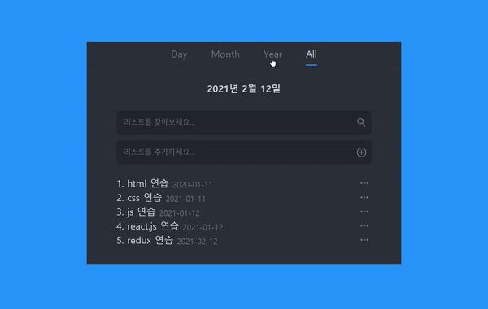

# toDoList

html,css 기초부터 프론트엔드 개발자가되기위한 과정을 단계별로 학습하면서 todoList를 만들어보았습니다. 총4가지 버전으로 브랜치를 나눠서 만들었으며, 최종 react-axios브랜치에서는 OAuth개념도 적용시켜서 최종본을 만들어보았습니다.

</img>

## 설명

브랜치별로 기술코드를 확인할 수 있습니다.

<h3>브랜치</h3>
<ol>
  <li>main
    
main브랜치는 default로서 코드가 없습니다.

  </li>
  <li>pure-javascript
    
html, css, varnilla-javascript로만 구현하기 위하여 노력하였으며, javascript코드는 app.js파일 한곳에 모두 코딩하였습니다. 

  </li>
  <li>pure-javascript-refactoring
    
기능별로 파일을 분할하여 유지보수가 가능하도록 리팩토링 하였으며, 폴더트리를 util과core로 나누어보았습니다. 또한 최대한 재사용 함수를 만들어서 사용하였습니다.

  </li>
  <li>pure-javascript-webpack
    

      웹팩의 기본적이 구동원리를 파악하기 위하여 진행하였습니다. 모듈시스템을 적용하였스며, es6문법인 import/export문법을 사용하여 나눈 파일들의 기능을 불러 구현하였습니다. 
    

  </li>
  <li>react-axios
    
react라이브러리를 이용하여 구현하였습니다. 상태관리로는 redux-toolkit을 사용해 보았으며, styled-components로 스타일을 구현하였습니다. 또한 server와의 연동으로는 axios를 사용하였고 kakao 로그인 서비스를 적용하였습니다.

  </li>
</ol>
